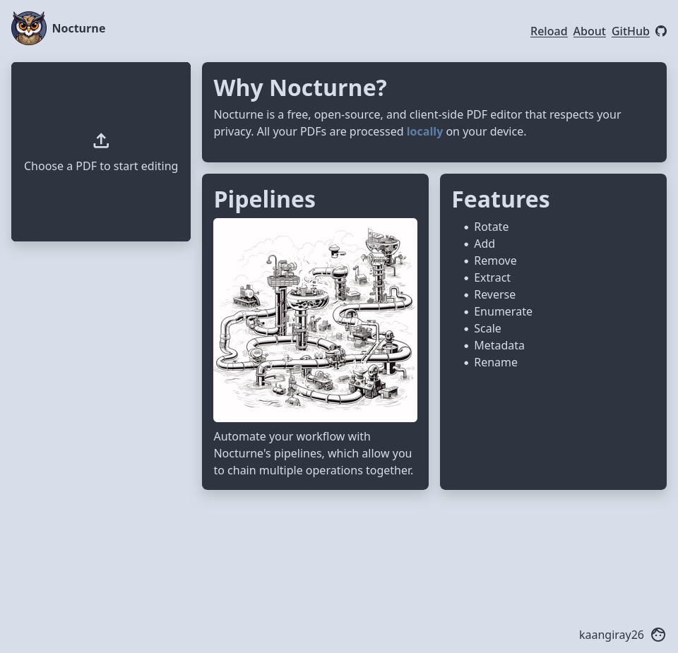
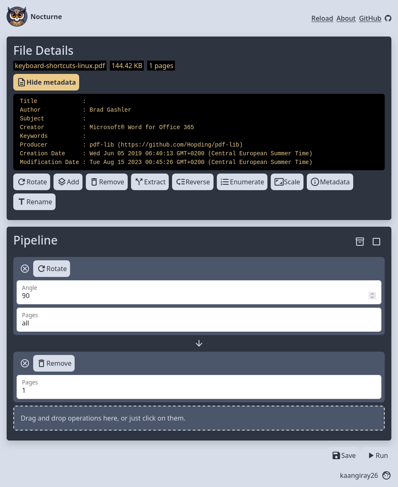

    
    <h1 align="center">Nocturne</h2>
    <a href="https://www.nocturne.rocks/">Open in your browser</a>
    

        An open-source client-side PDF editor with configurable pipelines
         
        

            
            
            
            
        

        <a href="https://github.com/kaangiray26/nocturne/issues">Report Bug</a>
        ·
        <a href="https://github.com/kaangiray26/nocturne/issues">Request Feature</a>
    

## Screenshots

    
    

